# Gloss

**A deliberately complicated presentation that AI struggles to make natively.**

Gloss is the presentation itself: an open, deliberately complicated 20-slide
challenge for presentation-generating AI. The goal is not to make screenshots
that happen to look like slides. The goal is to make a real presentation:
editable text, native charts and tables, working masters and layouts, live
fields, connected shapes, correct reading order, and intentional grouping all
the way down.

Gloss is not primarily a measurement tool. The deck is the challenge. A small
checker and deeper measurement tools are bundled with it to make native quality
easy to inspect, compare, and improve.

The name expands to **Generative Layout & Object Structure Standard**: a reminder
that layout is visible, while object structure is what keeps a presentation real.

**[Open gloss.tools](https://gloss.tools)** ·
**[Download the deck](https://github.com/aronchick/gloss/raw/refs/heads/main/gloss-v1/benchmark/deck/gold/gloss-v1-gold.pptx)** ·
**[Copy the exact prompt](gloss-v1/benchmark/prompts/DESIGNER_BRIEF.md)** ·
**[Join the work](https://github.com/aronchick/gloss/issues)**

> **A screenshot is not a presentation. The artifact is the product.**

## Remember ACID?

[Acid1](https://www.w3.org/Style/CSS/Test/CSS1/current/sec53.htm),
[Acid2](https://www.webstandards.org/action/acid2/), and
[Acid3](https://wpt.live/acid/acid3/test.html) gave every browser the same hostile public
artifact. You did not need a white paper to see what the browser understood and
what it did not.

**Gloss is ACID for presentation decks made by AI.** It publishes the hard
artifact, the exact instructions, the reference renders, and the checks so anyone
can inspect a result, find a failure, and improve the ecosystem.

Here, ACID refers to the browser conformance-test tradition—not database
transactions. **Gloss** is the public project. **Gloss v1** is its first bundled
challenge suite.

## Try it in three minutes

1. [Download the native Gloss v1 deck](https://github.com/aronchick/gloss/raw/refs/heads/main/gloss-v1/benchmark/deck/gold/gloss-v1-gold.pptx).
2. Move one object on one slide and a second object on another slide. Save it as
   `edited.pptx`.
3. Run the checker. It reports those two native objects—one finding per object.

```bash
git clone https://github.com/aronchick/gloss.git
cd gloss/gloss-v1/grader
uv sync --extra dev --locked
uv run gloss check /path/to/edited.pptx
```

An untouched copy returns:

```text
Exact match. No native objects changed.
```

Move two objects and it returns only two findings:

```text
2 native objects changed:
  Slide 02 · placeholder “Agenda” · changed: position
  Slide 12 · placeholder “Document Fields” · changed: position
```

`gloss check` is the friendly front door: a strict native-object diff against the
public deck. The deeper `gloss grade` protocol remains available for rendered
comparison, semantic assertions, provenance, and release work.

## The deck

Each slide isolates something that can look correct while being built incorrectly.
Open any reference image, then inspect the corresponding
[canonical slide instructions](gloss-v1/benchmark/prompts/variants/canonical).

### 01 — Cover / Title Stress Test

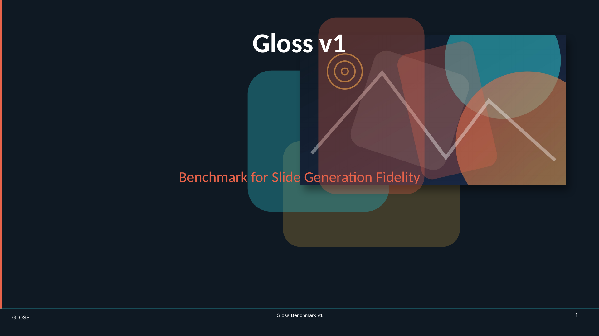

**Demonstrates:** a cinematic title composition with an image, translucent shapes,
and a master-driven footer. **Tests natively:** layout placeholders, image crop,
z-order, opacity, shadow, and inherited slide numbers.

### 02 — Dense Agenda with Layout Semantics

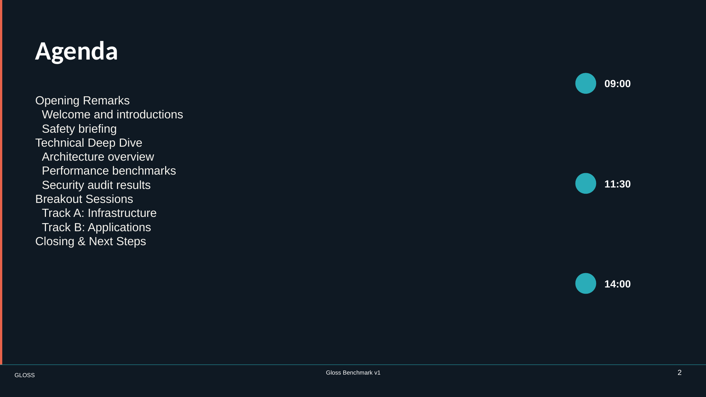

**Demonstrates:** a dense agenda that still reads cleanly. **Tests natively:**
placeholder use, real bullet levels, paragraph spacing and indentation, flat
grouping, and exact alignment.

### 03 — Native Table Stress Test

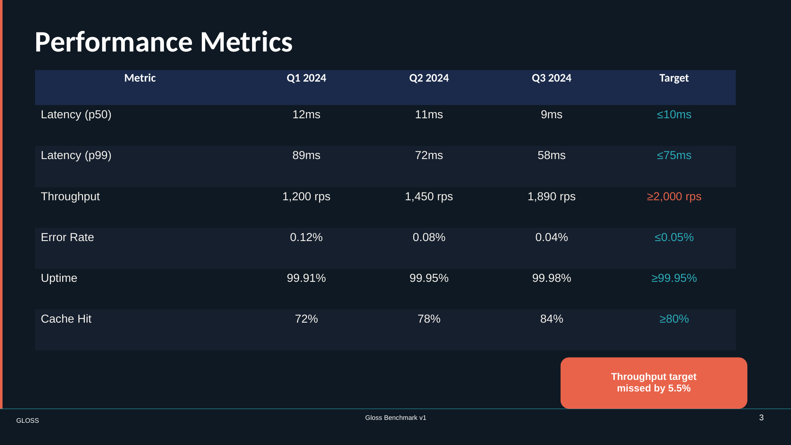

**Demonstrates:** a formatted performance table with a connected annotation.
**Tests natively:** a real table—not a pile of rectangles—plus cell styling,
mixed border weights, paragraph indents, and connector placement.

### 04 — Native Chart Stress Test

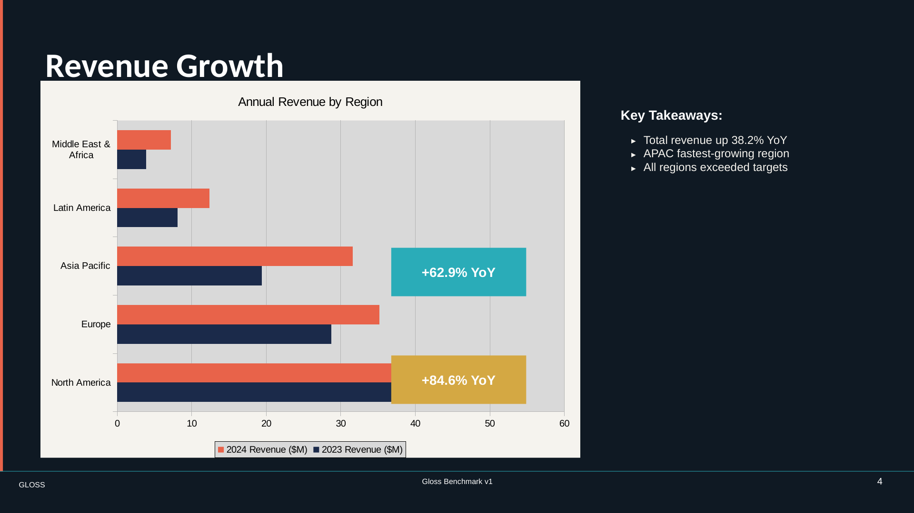

**Demonstrates:** a data-rich chart with annotations and takeaways. **Tests
natively:** an editable chart with correct source data, chart type, labels,
gridlines, legend, overlay shapes, and arrow connectors.

### 05 — Master Reuse Enforcement

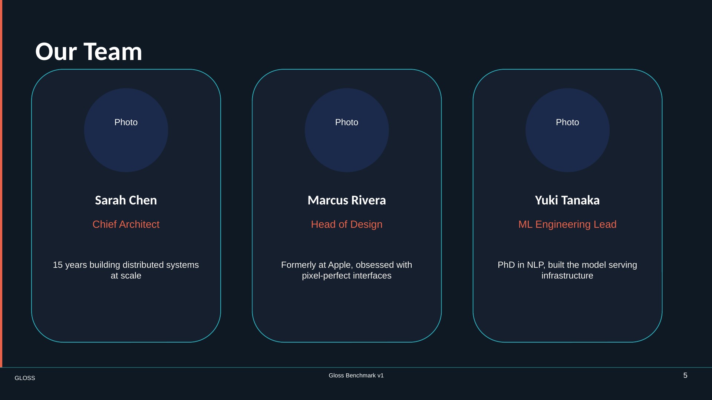

**Demonstrates:** a repeatable card system. **Tests natively:** master and layout
inheritance, grouped card objects, equal distribution, placeholders, and a footer
that is inherited instead of manually copied.

### 06 — Multilingual Editorial

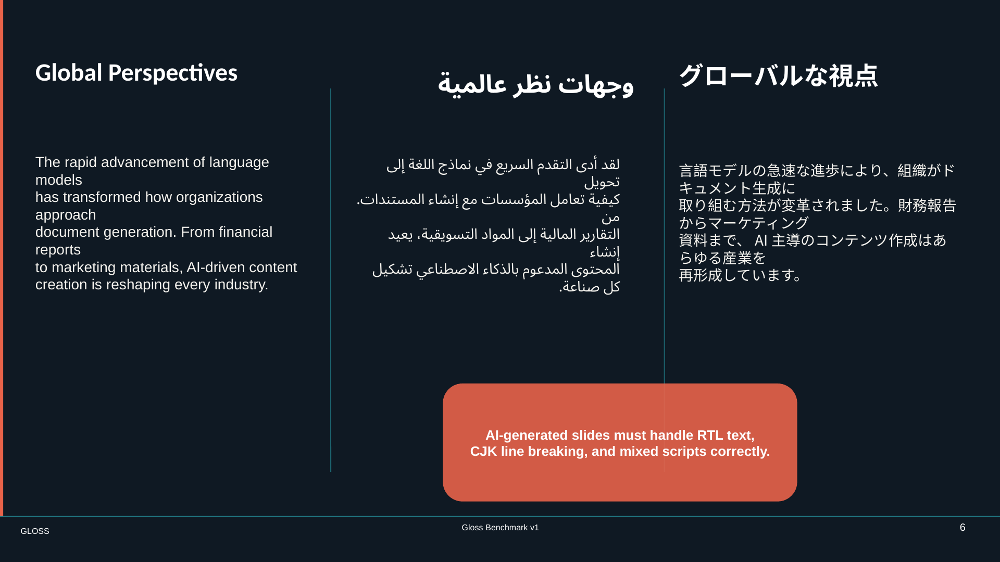

**Demonstrates:** English, Arabic, and Japanese sharing one editorial canvas.
**Tests natively:** RTL paragraph direction, CJK line breaking, script-specific
fonts, exact Unicode text, and an intentional cross-column overlap.

### 07 — Image Crop and Mask

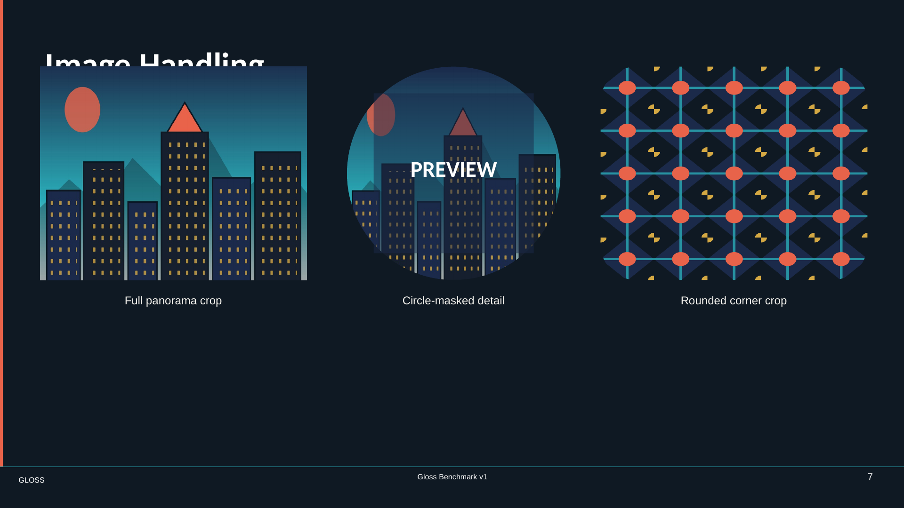

**Demonstrates:** three treatments of approved source imagery. **Tests natively:**
independent crop rectangles, circle and rounded-rectangle masks, asset identity,
and a translucent overlay in the right z-order.

### 08 — Overlap, Shadow, and Transparency

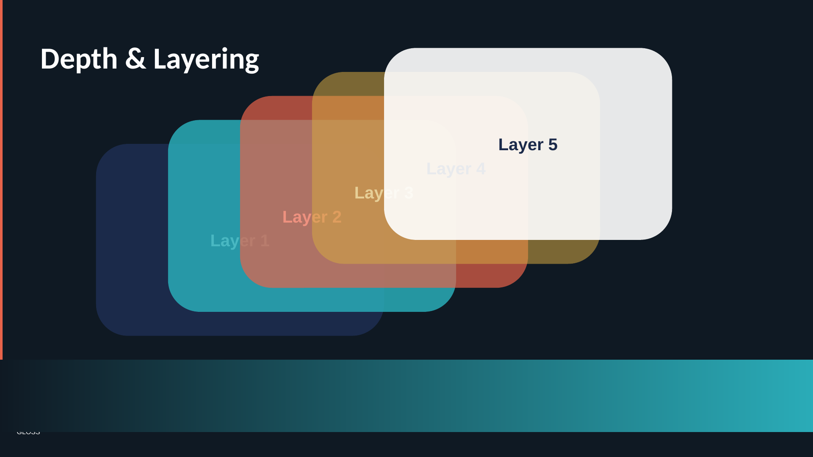

**Demonstrates:** a cascading stack with convincing depth. **Tests natively:**
precise z-order, five opacity levels, shadows, selective grouping, and a real
gradient fill.

### 09 — Dense Text Overflow

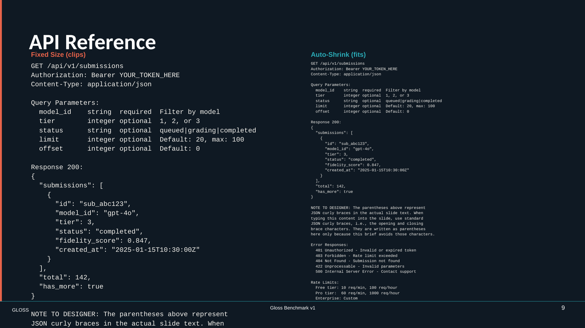

**Demonstrates:** two code-heavy columns with deliberately different overflow
behavior. **Tests natively:** fixed-size clipping versus auto-shrink, preserved
whitespace, monospaced runs, exact indentation, and line spacing.

### 10 — Connector and Alignment Diagram

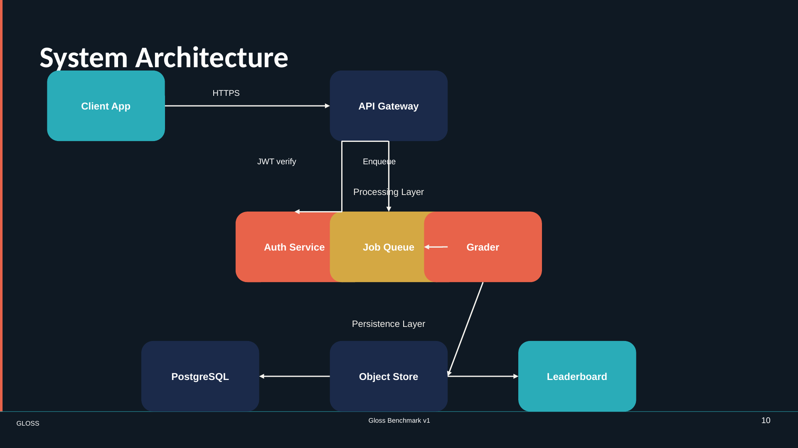

**Demonstrates:** a legible systems diagram. **Tests natively:** connectors that
remain attached to shapes, elbow routing, arrowheads, grid alignment, labels, and
nested backend groups.

### 11 — Theme vs. Local Override

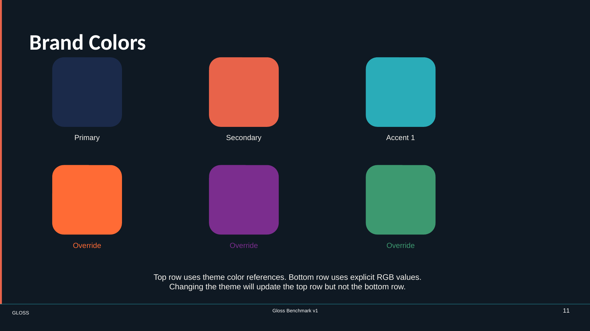

**Demonstrates:** two rows of nearly identical swatches. **Tests natively:** the
invisible semantic difference between theme-linked colors and explicit RGB
overrides—the kind of distinction a screenshot cannot prove.

### 12 — Native Field Slide

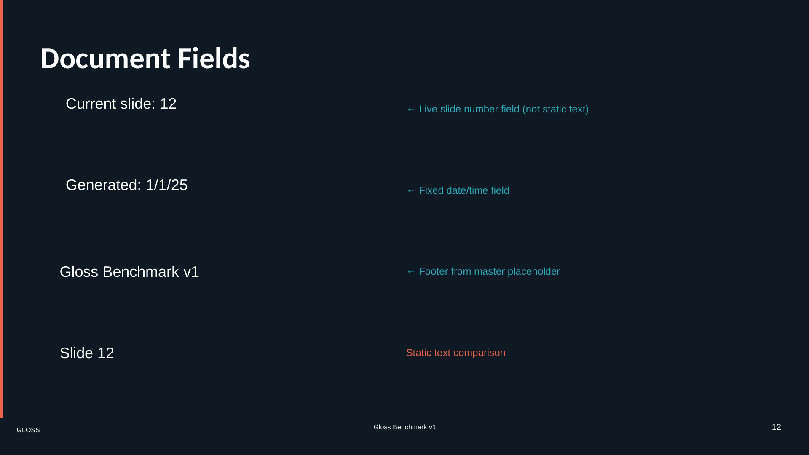

**Demonstrates:** live document metadata next to a static lookalike. **Tests
natively:** slide-number and fixed-date fields, a master footer field, and the
difference between a live field and typed text.

### 13 — Composite Stress

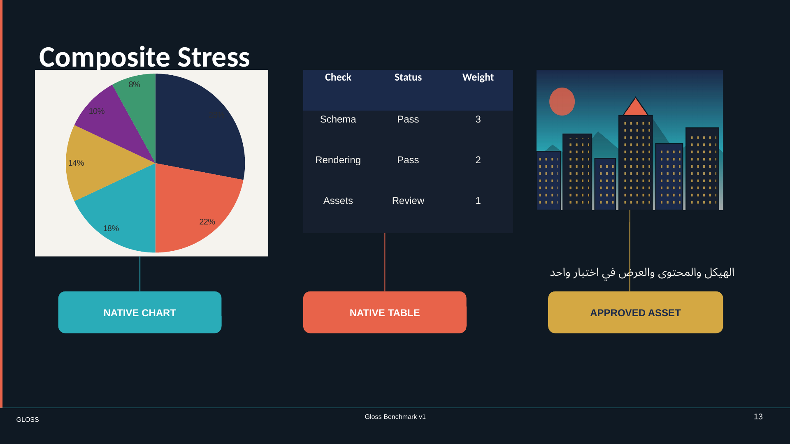

**Demonstrates:** chart, table, image, Arabic annotation, and dense callouts in one
composition. **Tests natively:** multiple editable object types and their
relationships surviving together.

### 14 — RTL-Heavy Comparison

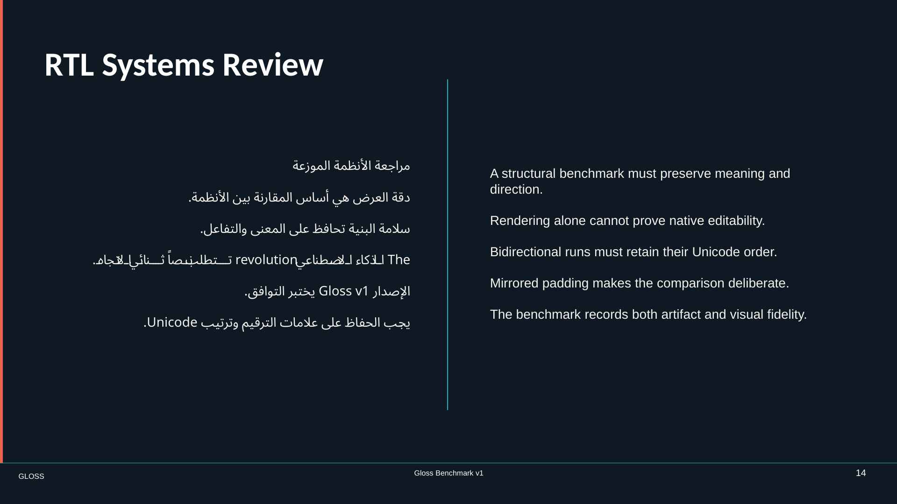

**Demonstrates:** a mirrored Arabic/English comparison. **Tests natively:**
right-to-left paragraphs, mixed bidirectional runs, script-aware fonts, and
mirrored alignment without flattening text.

### 15 — Rotated Text

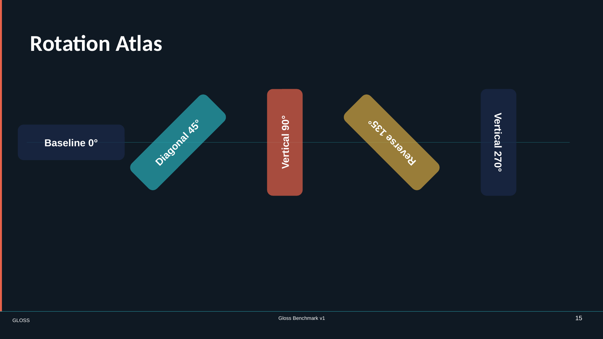

**Demonstrates:** typography at 0°, 45°, 90°, 135°, and 270°. **Tests natively:**
real rotation values, anchor points, bounding boxes, and shapes aligned to rotated
text.

### 16 — Intentional Off-Canvas Bleed

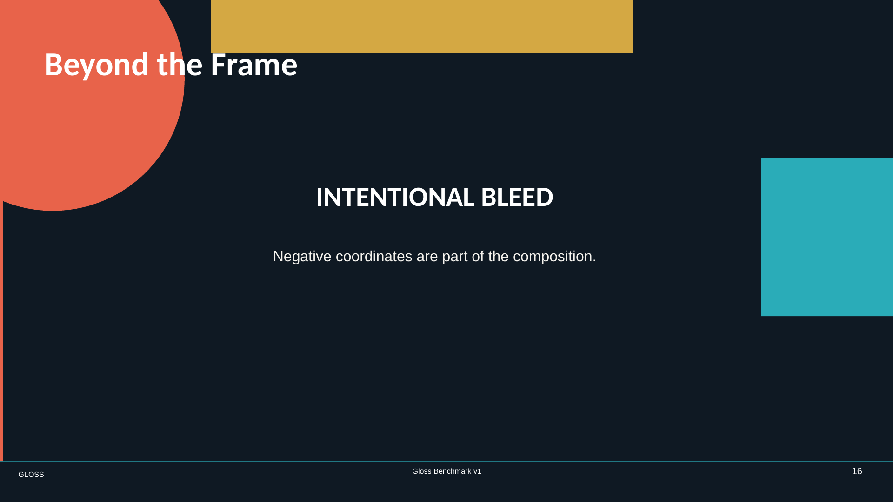

**Demonstrates:** design elements that deliberately continue beyond the canvas.
**Tests natively:** negative coordinates and overhanging geometry without clipping,
normalizing, or “fixing” intentional overflow.

### 17 — Deep Grouping

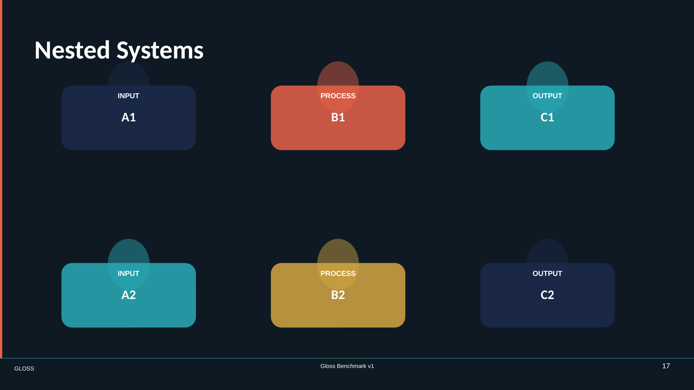

**Demonstrates:** a composition built from nested visual systems. **Tests natively:**
three levels of groups, exact membership, child transforms, and z-order inside each
nesting level.

### 18 — Multi-Column Editorial

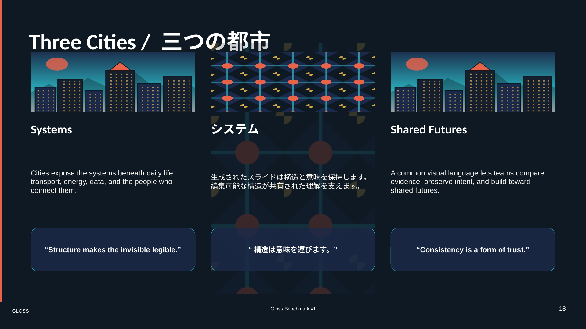

**Demonstrates:** a three-column English/Japanese magazine layout. **Tests
natively:** column structure, repeated image treatments, pull quotes, mixed-script
text, and a patterned background.

### 19 — Repetition and Consistency

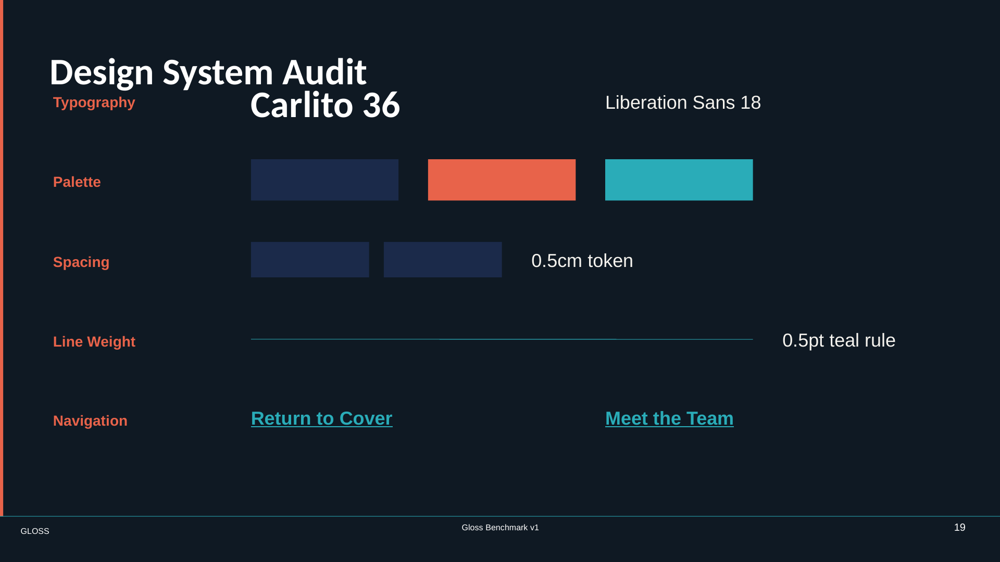

**Demonstrates:** the deck’s design language as a consistency audit. **Tests
natively:** master-derived typography, colors, spacing, line weights, and reusable
layout behavior across the full document.

### 20 — Final Torture Slide

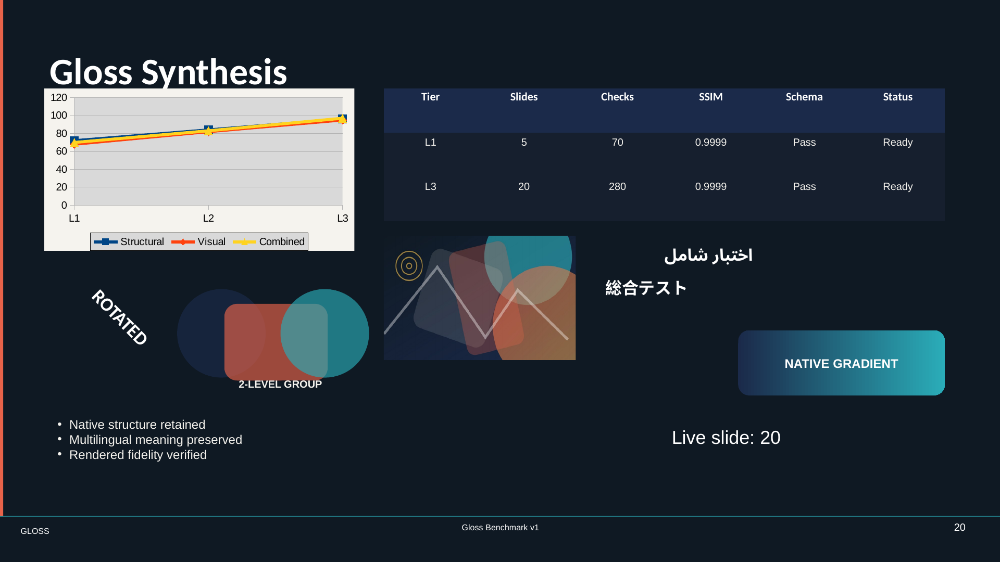

**Demonstrates:** the whole challenge in one dense synthesis. **Tests natively:** a
chart, table, cropped image, Arabic and Japanese text, rotated type, transparent
layers, connectors, fields, groups, and master inheritance at once.

## Give the exact challenge to an AI

The complete prompt is already assembled in one copyable file:

**[Open the exact Gloss v1 authoring prompt →](gloss-v1/benchmark/prompts/DESIGNER_BRIEF.md)**

Give the AI that prompt together with:

- the [20 reference images](gloss-v1/benchmark/deck/exports);
- the [approved assets](gloss-v1/benchmark/assets);
- the [bundled font set](gloss-v1/benchmark/fonts).

Do not give it the native gold deck. Ask for an editable native presentation,
save the result as `.pptx`, and run `gloss check` against it. The experiment is
intentionally reproducible: every instruction, reference, asset, and check is in
this repository.

## Native presentations, not one app

Gloss is about native presentations across PowerPoint, Google Slides, and Keynote.
The principle is format-independent: a chart should remain a chart, text should
remain text, and layout behavior should survive editing.

Gloss v1 is honestly **PPTX-first**. OOXML is a published standard with an
inspectable package and object structure, which makes independent local checking
possible today. Google Slides and Keynote coverage should use the same public,
artifact-first philosophy as their reliable inspection surfaces mature. Help us
define those adapters in [Issues](https://github.com/aronchick/gloss/issues).

## The tools make measurement easy

The presentation is Gloss. The tools are its measuring instruments. The simple
check answers the first question: *what native objects changed?* The bundled
advanced grader can also inspect rendered pixels, typography, geometry, charts,
tables, layouts, masters, text semantics, relationships, and package safety.
They make the hard presentation easier to understand and improve; they are not
the product’s identity.

The current candidate suite contains 280 schema-valid checks and generated
operator fixtures. That evidence proves configured checker behavior, not an
official model leaderboard. See [GLOSS_OPENSPEC.md](GLOSS_OPENSPEC.md) for the
draft protocol and [the public evidence bundle](site/evidence/preview-v1.json) for
the receipts.

## Public today, harder tomorrow

Gloss v1 is public by design. That also means it may become training data for the
systems it tests. This release is the starting line, not a permanent secret exam.

Future generations need automated ways to create difficult decks, hold cases back,
delay disclosure, rotate prompts, and publish them after evaluation. The public
suite remains valuable as a shared conformance target; hidden generations will
measure generalization.

## Build it with us

The browser ACID tests mattered because standards failures became visible and the
community could make the tests better. Gloss should work the same way.

- [Propose a difficult presentation behavior](https://github.com/aronchick/gloss/issues/new?template=benchmark-case.yml)
- [Report a checker gap](https://github.com/aronchick/gloss/issues/new?template=grader-bug.yml)
- [Challenge evidence or a public claim](https://github.com/aronchick/gloss/issues/new?template=evidence-challenge.yml)
- [Send a pull request](https://github.com/aronchick/gloss/pulls)
- Read [CONTRIBUTING.md](CONTRIBUTING.md)

## Repository map

```text
gloss-v1/benchmark/deck/       Native challenge deck + 20 reference renders
gloss-v1/benchmark/prompts/    One exact brief + per-slide prompt variants
gloss-v1/benchmark/assets/     Approved source assets
gloss-v1/grader/               Simple checker + advanced grading protocol
site/                          Static gloss.tools source
GLOSS_OPENSPEC.md              Draft protocol for the bundled v1 suite
```

Code and benchmark materials are released under the
[Apache License 2.0](LICENSE), except third-party assets with their own notices.
